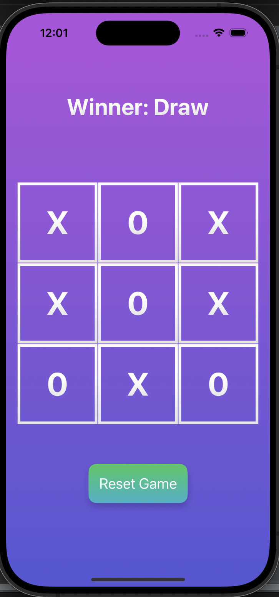

# 🎮 Tic Tac Toy

Tic Tac Toy is a beautifully designed **Tic Tac Toe game** for iOS, created using Swift and SwiftUI. This project is perfect for iOS developers who want to learn or practice building a game using **MVVM architecture**, **particle effects**, and modular components. 🕹️✨


---

## 📂 Project Structure

The project follows a clean architecture with proper organization for scalability and readability:

```
Tic Tac Toy
│
├── Utils
│   ├── Components.swift      # UI Components for reusability
│   └── Extension.swift       # Helpful Swift extensions
│
├── Model
│   └── Particle.swift        # Model for particle effects
│
├── ViewModel
│   └── GameViewModel.swift   # Logic and state management
│
├── View
│   ├── ContentView.swift     # Main UI for the game
│   ├── ParticleView.swift    # Particle animation implementation
│   └── Tic_Tac_ToyApp.swift  # Entry point for the app
│
├── Assets.xcassets           # Images, colors, and assets
└── Preview Content           # Xcode previews for SwiftUI
```

---

## 🌟 Features

- **Beautiful Gradient UI**: An elegant, colorful design to enhance the gaming experience.
- **One-Player Mode**: Play Tic Tac Toe with computer!
- **Dynamic Turn Indicator**: Always know whose turn it is with a clear label.
- **Particle Animations**: Fun particle effects when a player wins!
- **Clean Architecture**: Organized with **MVVM** for easy understanding and future development.
- **Fully SwiftUI-Based**: Modern iOS development practices.

---

## 🚀 Getting Started

Follow these steps to get the project up and running on your local environment:

### Prerequisites
- **Xcode 14+**
- **macOS Monterey or later**
- Basic knowledge of Swift and SwiftUI

### Installation
1. Clone the repository:
   ```bash
   git clone https://github.com/RanaAk/tic-tac-toy.git
   ```
2. Open `Tic_Tac_Toy.xcodeproj` in Xcode.
3. Build and run the app on the iOS simulator or a physical device.

---

## 🛠️ How It Works

1. The game board is implemented using a grid layout in **SwiftUI**.
2. Player turns are managed with a `GameViewModel` to ensure clear and responsive state management.
3. **Animations and effects** are handled with the `ParticleView` and `Particle.swift` classes.
4. Winner detection logic is embedded in the `GameViewModel`.

---

## 📸 Screenshots

### Gameplay Screen


---

## 💡 Future Improvements

- Add support for AI to play against the computer.
- Able to play with friends
- Create a scoring system to track wins and draws.
- Add sound effects for an immersive experience.

---

## 🙌 Contributing

Contributions are welcome! If you have ideas or want to improve the project, feel free to:

1. Fork the repository
2. Create a new branch:
   ```bash
   git checkout -b feature-name
   ```
3. Commit your changes and push to the branch:
   ```bash
   git push origin feature-name
   ```
4. Open a pull request

---

## 📄 License

This project is licensed under the MIT License - see the [LICENSE](LICENSE) file for details.

---

## 👨‍💻 Author

Developed with ❤️ by **[Mehedi Akbar Rana](https://github.com/RanaAk)**.
